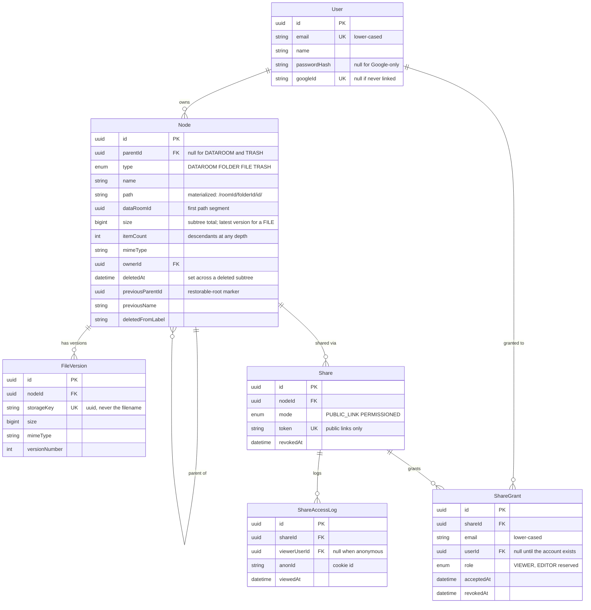

# Strongroom — a virtual data room

A due-diligence data room: create rooms, organise files and folders inside them,
and share a room, a folder, or a single file — by public link or with named
people by email.

**Live:** https://strongroom.shamko.me · API at `/api/v1`
**Demo account:** `demo@strongroom.test` / `demo-password-001`

---

## Contents

- [Strongroom — a virtual data room](#strongroom--a-virtual-data-room)
  - [Contents](#contents)
  - [What it does](#what-it-does)
  - [Demo user](#demo-user)
  - [Run it locally (no cloud accounts needed)](#run-it-locally-no-cloud-accounts-needed)
  - [Run it in production (Docker + nginx)](#run-it-in-production-docker--nginx)
    - [Row-level security on the Supabase database](#row-level-security-on-the-supabase-database)
    - [Build-time versus run-time environment](#build-time-versus-run-time-environment)
    - [Why both apps sit on one origin](#why-both-apps-sit-on-one-origin)
  - [Architecture](#architecture)
  - [Data model](#data-model)
  - [How it scales](#how-it-scales)
    - [Total size and item count of a folder, including its whole subtree](#total-size-and-item-count-of-a-folder-including-its-whole-subtree)
    - [What changes when one data room holds 100,000 files](#what-changes-when-one-data-room-holds-100000-files)
    - [How sharing extends to per-user roles without remodeling](#how-sharing-extends-to-per-user-roles-without-remodeling)
  - [Design decisions](#design-decisions)
  - [Tests and CI](#tests-and-ci)
  - [Where AI was used](#where-ai-was-used)
  - [Known gaps](#known-gaps)

---

## What it does

**Folders** — create and nest to any depth (capped at 32), browse with
breadcrumbs that collapse past four segments, rename, and delete with a warning
that names exactly what disappears.

**Files** — multi-file drag-and-drop upload with real per-file progress, an
in-app PDF viewer, rename with conflict resolution, move via a folder picker,
and delete. Uploads go **straight from the browser to blob storage** via a
scoped signed URL; the API verifies the object's real size and content type
before recording it.

**Sharing** — a room, folder or file can be shared as a public link or with
named people by email, read-only, inheriting to everything nested beneath.
Every share can be revoked. Grants made to an address that has no account yet
are linked automatically at that address's first sign-in.

**Beyond the brief** — search and filtering across a room (name, type, mimetype,
size and date ranges), file versioning on name conflicts, a Trash with restore
and a 30-day TTL, light/dark theme, and a mobile layout.

---

## Demo user

**Email**: demo@strongroom.test
**Password**: demo-password-001

## Run it locally (no cloud accounts needed)

The point of this path is that **nothing external is required**: no Supabase, no
Resend, no Google OAuth. Each of those ports falls back to a local adapter, so
the real upload handshake, the real share flow and the real login all work
offline.

**Requires** Node 22 and pnpm 10. Postgres comes from Docker, or use one you
already have.

```bash
git clone https://github.com/maksymshamko/dataroom.git
cd dataroom
pnpm install

# 1. A database (skip if you have Postgres already — just edit DATABASE_URL)
docker compose -f docker-compose.dev.yml up -d      # Postgres on :5433

# 2. Environment — one file at the repo root, for both apps
cp .env.example .env

# 3. Schema and the demo account
pnpm db:migrate
pnpm db:seed

# 4. Both apps
pnpm dev            # web on :3000, api on :3001
```

Open http://localhost:3000 and sign in with the demo account above.

**What the fallbacks do**

| Unset variable | What happens instead |
|---|---|
| `SUPABASE_URL` | Files are stored by the API itself and served through signed `/dev-storage` URLs. The browser still PUTs directly to a signed URL, so the real upload flow is exercised — not stubbed. |
| `RESEND_API_KEY` | Share invites go to an in-memory mailer and are logged rather than sent. Access is granted either way; the email is only a notification. |
| `GOOGLE_CLIENT_ID` | The "Continue with Google" button is hidden. Email/password is the only route in. |
| `SENTRY_DSN`, `POSTHOG_KEY` | Telemetry is inert. |

Everything is one `.env` at the repository root (see `.env.example`). Both apps
resolve it by walking up to the workspace root, so it works regardless of which
directory a command runs from.

**Pointing uploads at real Supabase Storage**

Two things have to be right, and getting either wrong surfaces as
`new row violates row-level security policy` on the first upload:

1. **The bucket exists.** Storage → New bucket, named to match
   `SUPABASE_BUCKET` (default `dataroom`). Keep it **private** — every read
   goes through a short-lived signed URL (§7.6), so public access would defeat
   the access model.
2. **`SUPABASE_SERVICE_ROLE_KEY` is the privileged key.** Project Settings →
   API keys → the `service_role` secret (or an `sb_secret_…` key on newer
   projects). The `anon` / publishable key from the same page authenticates
   fine but is subject to row-level security, so it cannot write objects. No
   storage policies are needed with the right key — it bypasses RLS. The API
   refuses to start on an `anon`/publishable key rather than failing later.

Uploads accept **PDF only** (§7.2) — that is the format the in-app viewer
renders. `ALLOWED_MIME_TYPES` in `packages/contracts/src/uploads.ts` is the one
place to widen it.

---

## Run it in production (Docker + nginx)

Two containers, web and api. **Postgres is not containerized** — production uses
Supabase, and shipping a second database would invite drift between what is
tested and what runs.

```bash
cp .env.example .env      # fill in DATABASE_URL, JWT_SECRET, Supabase, etc.
docker compose --env-file .env up -d --build
```

- web listens on **127.0.0.1:3400**
- api listens on **127.0.0.1:3401**

Then paste `deploy/nginx/strongroom.conf` into your system nginx
(`/etc/nginx/sites-available/`, symlinked into `sites-enabled`) and run
`nginx -t && systemctl reload nginx`.

### Row-level security on the Supabase database

Nothing reaches the tables over Supabase's REST/realtime API. The browser talks
only to this API, and this API talks to Postgres through Prisma over a direct
connection — so `anon` and `authenticated`, the roles PostgREST assumes for
anything holding a publishable key, should have no access at all.

Migration `20260826090000_enable_row_level_security` states that:

- RLS on for every table in `public`, so a leaked publishable key sees no rows;
- table, sequence and function privileges revoked from `anon` and
  `authenticated`, including for tables Prisma creates later, so the refusal
  happens at the privilege check and not only at RLS;
- one `service_role_full_access` policy per table, which grants nothing new
  (`service_role` bypasses RLS regardless) but records who these tables are for
  and clears Supabase's "RLS enabled, no policy" advisor notice.

Two things it deliberately does not do:

- **No `FORCE ROW LEVEL SECURITY`.** Prisma connects as the role that owns
  these tables, and an owner is exempt from its own policies. Forcing it would
  apply them to the API's own connection and every query would return zero
  rows. If you ever point `DATABASE_URL` at a role that neither owns the tables
  nor holds `BYPASSRLS`, that role needs policies of its own — deny-by-default
  will otherwise silently return nothing.
- **No Storage policies.** Uploads and downloads go through signed URLs minted
  with the `service_role` key, which bypasses storage RLS; a policy would only
  widen access. See the bucket setup above.

A table added by a future migration is not covered automatically — Postgres has
no default for this — so enable RLS on it in the migration that creates it.

### Build-time versus run-time environment

This is the distinction that breaks deployments, so it is worth stating plainly:

- **Next.js bakes `NEXT_PUBLIC_*` into the client bundle at build time.** They
  are passed as `ARG` to `docker build` — compose does this for you. Setting them
  only as runtime `environment` produces an image that silently talks to the
  wrong API.
- **Everything the API reads is run-time** — `DATABASE_URL`, `JWT_SECRET`,
  Supabase, Resend, Google, Sentry. None of it is baked into an image.

Both Dockerfiles declare `ARG ENV`, and the API image applies its own migrations
on start (`prisma migrate deploy`), so a deploy never depends on a remembered
manual step.

### Why both apps sit on one origin

nginx serves the web app at `/` and the API at `/api/v1` on the same host, so the
browser calls the API at the **relative** path `/api/v1`. That removes CORS from
production entirely and keeps the session cookie same-origin. In local
development the two really are different origins, so `NEXT_PUBLIC_API_URL` is
absolute there.

---

## Architecture

```
apps/api/src/
  domain/        pure business logic — no framework, no driver, no I/O
  application/   use cases + the port interfaces they depend on
  infra/         adapters: Prisma repositories, Supabase storage, Resend mailer,
                 bcrypt, JWT, Sentry, PostHog — and an in-memory twin of each
  api/           NestJS controllers, guards, DTOs, composition root
apps/web/        Next.js App Router, Tailwind v4, Radix primitives
packages/contracts/  Zod schemas + DTO types shared by both apps
```

Dependencies point inward only, and a test enforces it:
`test/unit/layering.spec.ts` fails the build if `domain/` or `application/` ever
import a framework or a driver. Replacing Postgres, Supabase or Resend is a
change inside `infra/` plus one line in the composition root.

The transaction boundary is a `UnitOfWork` port: a use case calls
`uow.run(repos => …)` and receives port-typed repositories, never a Prisma
transaction handle. That is what lets the application layer use transactions
without knowing what a transaction is made of.

**Stack** — NestJS 11, Prisma 6, PostgreSQL 16, Supabase Storage, Next.js 15,
React 19, Tailwind v4, Radix, Resend, Vitest, Playwright.

---

## Data model



**A data room is a `Node`, not its own table.** `type = DATAROOM` with
`parentId = null` is the tree root. That single decision is what makes
`Share.nodeId` cover a room, a folder and a file with no polymorphic branch, and
what lets one access rule serve all three.

**Paths are materialized.** Every node stores `/roomId/folderId/id/`. A subtree
is an indexed prefix match, ancestors are parsed from the string rather than
walked, and moving a subtree is a single `UPDATE`.

---

## How it scales

### Total size and item count of a folder, including its whole subtree

They are **stored on the folder and maintained incrementally**, not computed on
read. Every mutation applies one delta to the entire ancestor chain inside the
same transaction as the write:

```sql
UPDATE "Node"
SET size = size + $delta, "itemCount" = "itemCount" + $count, "updatedAt" = now()
WHERE id = ANY($ancestorIds);
```

The ancestor ids come free from the materialized path — no recursive query. So
reading a folder's total is a column read, and writing costs one extra `UPDATE`
over at most 32 rows.

The alternative — aggregating the subtree on read — is `O(subtree)` per page view
and would collapse on a 100k-file room. The cost of the incremental approach is
that the arithmetic has to be right, so it is isolated in one pure function
(`domain/rollup-delta.ts`), and a test runs a mixed workload, recomputes every
rollup from scratch, and asserts nothing changed.

Two details that matter: a file's size is its **latest** version only, so
versioning never inflates folder totals; and `itemCount` counts descendants at
any depth, matching what the UI shows.

### What changes when one data room holds 100,000 files

Mostly nothing, because the shape was chosen for it:

1. **Listing is cursor-paginated, never offset.** The sort tuple is
   `(typeRank, sortKey, id)` and the cursor carries all three, compared as a SQL
   row value. `OFFSET 99000` degrades linearly; this does not. `id` is the
   tie-breaker that makes the tuple total, so a page boundary can neither repeat
   nor skip a row.
2. **Indexes cover the access paths that matter** — `(parentId, type, name)` for
   listing a folder, `(dataRoomId)` for room scoping, `(path)` for subtree
   queries, `(ownerId, type)` for the dashboard, `(deletedAt)` for Trash.
3. **Access filtering happens in SQL, not after fetch.** A viewer's active share
   set becomes a path-prefix predicate in the query, so someone holding one share
   never pulls a room's worth of rows just to discard them.
4. **A trashed subtree is excluded by an indexed `deletedAt IS NULL`**, not by a
   path comparison, so the hot read paths cost no extra lookup.

What would need work beyond that: search uses `ILIKE`, which is fine to roughly
this size and then wants a trigram index or a `tsvector` column; and the
`(parentId, name)` conflict check is one indexed lookup per upload, fine
individually but the thing that would bite in a bulk import of tens of thousands
of files at once.

### How sharing extends to per-user roles without remodeling

It already does. `ShareGrant.role` is an enum that today has one member,
`VIEWER`, and the schema reserves `EDITOR`. Adding editors is two steps:

1. Add `EDITOR` to the enum — one migration, no table changes.
2. Change one function. Authorization is a single pure function over facts
   (`domain/access-decision.ts`), which today reads:

   ```ts
   canWrite(node, viewer) := viewer.isOwnerOf(node.dataRoomId)
   ```

   and becomes "…or holds an active grant whose role is `EDITOR`". Every endpoint
   already calls `assertRead` / `assertWrite`, so no controller changes.

Nothing else moves, because the grant is already per-user, per-share and
inherited through the tree — the role is the only missing dimension, and it has
a column waiting for it. The access-control test matrix is written over
principals rather than endpoints, so it extends by adding a principal.

---

## Design decisions

**A data room is a node.** Rooms, folders and files are one table with one tree,
so sharing, permissions, paths and rollups each have exactly one implementation.

**Materialized path over `ltree` or recursive CTEs.** Prisma has no first-class
`ltree` support, which would push raw SQL into layers that should not know about
it. An indexed `text` path answers the same questions.

**Uploads bypass the API.** The browser PUTs to a scoped, short-lived signed URL,
so there is no server bandwidth bottleneck and progress is real. The API then
asks storage for the object's actual size and content type and compares them with
what was declared before writing anything — the client's claim is never trusted
on its own.

**Default-deny access, and 404 rather than 403 for unreadable nodes.** Existence
is not leaked. A grantee who can read but not write gets 403; a stranger gets
404. Breadcrumbs are truncated to the highest ancestor the viewer may see, so
someone shared a single folder never learns the names of the folders above it.

**One conflict mechanism for upload, rename and move.** A conflict returns `409`
with a suggested name and nothing is written; the client retries with
`KEEP_BOTH`, `NEW_VERSION` or `REPLACE`. The decision stays with the user,
because that is where the dialog is.

**Database first, storage second.** Deletions commit in Postgres before objects
are purged. An orphaned object is a cost leak; a row pointing at a deleted object
is a broken product. A failed purge is recorded in `OrphanedObject` rather than
lost.

**Deleting is a move into Trash.** Restore reverses it under the item's original
name. Sharing is destroyed at delete and is *not* revived by a restore —
re-sharing is a deliberate act.

**Telemetry never carries names.** Document names *are* the confidential material
here, so share tokens are redacted from URLs, request bodies are dropped, and
analytics properties are filtered by key shape.

The full reasoning, including what was deliberately not built, is in
[`specs/`](specs/) and [`plans/`](plans/): each spec has numbered sections that
the tests cite, a record of amendments to earlier specs, and the questions left
open rather than silently answered.

---

## Tests and CI

```bash
pnpm test                        # 245 unit + integration (needs Postgres)
pnpm --filter @dataroom/web e2e  # 7 Playwright (needs both servers running)
```

GitHub Actions runs all of it on every pull request and every push to `main`:
typecheck, then the Vitest suite against a real Postgres service, then Playwright
against both apps booted with their local fallback adapters — so CI exercises the
upload handshake for real, with no cloud credentials.

The integration suite covers the whole HTTP surface, including an access-control
matrix over
{owner, grantee, revoked grantee, link viewer, revoked link, stranger, anonymous}
× {read, list, mutate}. Default-deny is the property most worth protecting here,
so it is the one tested hardest.

---

## Where AI was used

The whole thing was built with Claude Code, driven through a spec-first workflow
rather than by prompting for finished features:

1. **Specs first.** Each phase began with a numbered spec in [`specs/`](specs/) —
   API contracts, error codes, access rules, invariants. The specs are the
   artifact I reviewed and corrected; the code follows from them.
2. **Tests before implementation.** Every spec section that states behaviour got
   a test citing it (`// §6.4 rename conflict`) *before* the implementation
   existed, and those tests were confirmed red for the right reason.
3. **A plan, then a verification pass.** Each phase has a plan in
   [`plans/`](plans/) with a spec-section → test-file traceability table, and an
   explicit pass checking the plan against the spec. That pass caught real drift
   twice — both times the fix went into the spec, not quietly into the code.
4. **Then implementation**, until the red tests went green.

Where AI was most useful: mechanical breadth — the repository layer, DTO mappers,
the Tailwind work, and exhaustive cases around the access-control matrix. Where
it needed correcting: it initially stamped `deletedAt` on only the deleted node
rather than the whole subtree, and it wanted to show the `(1)` de-duplication
suffix in the Trash UI. Both were caught in review and fixed by amending the
spec first, with the reasoning recorded there.

The design reference in [`cd/`](cd/) was produced with Claude as a static HTML
document, then used as the visual source for the implementation.

---

## Known gaps

Documented rather than hidden; the specs carry the full reasoning.

- No real-time invalidation for someone viewing a node another user deletes —
  the next request 404s cleanly (001 §5).
- `ShareGrant.role` supports `EDITOR` in the schema, but only `VIEWER` is
  implemented (002 §5).
- Deleting an item destroys its `ShareAccessLog` history along with the shares it
  belonged to — intended, since the log describes access *through* that share
  (003 §9.2).
- Cross-data-room moves are refused rather than decided (002 §15.2).
- The Trash TTL purge runs on an in-process hourly interval; at real scale it
  belongs in a job runner (003 §9.3).
- No resend or reminder for pending share invites (001 §5).
